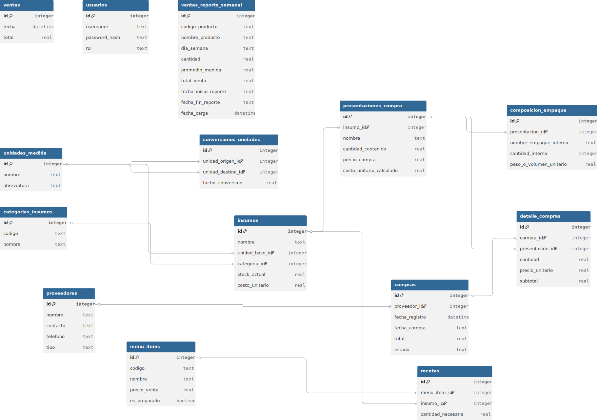

# Restaurante Italos Manager 🍽️


**Restaurante Manager** es una aplicación de escritorio desarrollada en Python diseñada para optimizar la gestión operativa de un restaurante. Permite administrar inventarios, recetas, costos, menús y analizar reportes de ventas, todo integrado en una interfaz gráfica intuitiva.

## 📋 Características Principales

El sistema cuenta con los siguientes módulos:

* **🔐 Autenticación y Usuarios:** Sistema de login seguro con roles (Administradores y Empleados). Los administradores pueden gestionar accesos a través de una interfaz de Gestión de Usuarios dedicada.
* **📈 Módulo de Presupuestos (NUEVO):** Creación de presupuestos de compras proyectados y enlace directo de estos presupuestos con las compras reales ejecutadas.
* **📅 Módulo de Ventas Consolidado:** Interfaz unificada en pestañas que permite cargar reportes de cierre (vía CSV/Excel), consultar el historial de reportes y registrar las ventas diarias de manera fluida.
* **📉 Control de Inventario:** Sistema de trazabilidad de stock que registra movimientos de entrada (compras), salidas (ventas según recetas) y ajustes, manteniendo el stock actualizado en tiempo real.
* **📦 Gestión de Insumos:** Control de stock, costos unitarios, unidades de medida, conversiones, así como grupos y factores de cálculo avanzados.
* **🍲 Recetas y Menú:** Creación de platos y definición de recetas (escandallo) para calcular costos precisos y descarga de insumos automática.
* **🛒 Compras y Proveedores:** Gestión integral de proveedores, registro de facturas (contado u otros métodos de pago) vinculadas a presupuestos, y actualización automática de precios y stock.
* **⚙️ Configuración Dinámica de BD:** Barra de estado inferior indicando el archivo activo y la opción para crear respaldos (backups), cambiar o cargar nuevas bases de datos SQLite desde la interfaz.

## 🗂️ Estructura del Proyecto

El proyecto sigue una arquitectura organizada separando la lógica de negocio (controladores), la interfaz (vistas) y los datos.

```text
restaurante_manager/
├── app/
│   ├── controllers/       # Lógica de negocio y autenticación
│   ├── database/          # Conexión a SQLite, migraciones y configuración
│   ├── views/             # Interfaz gráfica (Ventanas y Widgets)
│   │   ├── modulos/       # Módulos específicos (Ventas, Presupuestos, CRUDs, etc.)
│   │   ├── main_window.py # Ventana principal y ruteador
│   │   └── login_window.py# Ventana de acceso
│   └── styles.py          # Estilos visuales de la aplicación
├── assets/                # Iconos y archivos de datos (Excel/CSV)
├── data/                  # Base de datos SQLite y respaldos
├── diagrama_ER.svg        # Diagrama Entidad-Relación de la BDD
├── config.json            # Configuración de ruta activa de la Base de Datos
├── actualizar_db.py       # Script de migraciones estructurales
├── main.py                # Punto de entrada de la aplicación
├── requirements.txt       # Dependencias del proyecto
└── README.md              # Documentación del proyecto

```

## 🗃️ Modelo de Base de Datos
El sistema utiliza SQLite como motor de base de datos. El esquema incluye tablas relacionales para:

Maestros: Insumos, Proveedores, Recetas, Menú.

Transaccionales: Compras, Detalle de Compras, Registro de Ventas Diarias, Movimientos de Inventario.




## 🚀 Instalación y Requisitos
Para ejecutar este proyecto en tu máquina local, sigue estos pasos:

1. Prerrequisitos
Asegúrate de tener instalado Python 3.8 o superior.

2. Clonar el repositorio
Descarga el código fuente o clona el repositorio:

```
Bash

git clone <URL_DE_TU_REPOSITORIO>
cd restaurante_manager
```
3. Crear un entorno virtual (Recomendado)
```
Bash

### En Windows
python -m venv venv
venv\Scripts\activate

### En macOS/Linux
python3 -m venv venv
source venv/bin/activate
```
4. Instalar dependencias
Instala las librerías necesarias listadas en requirements.txt:

```Bash

pip install -r requirements.txt
```
💻 Ejecución
Para iniciar la aplicación, ejecuta el archivo principal desde la raíz del proyecto:

```Bash

python main.py
```
Al iniciar por primera vez:

Se creará automáticamente la carpeta data/ y la base de datos restaurante.db.

Se creará un usuario administrador por defecto (si así está configurado):

Usuario: admin

Contraseña: admin123 (Se recomienda cambiarla en producción)

## 🛠️ Tecnologías Utilizadas
Lenguaje: Python 3

Interfaz Gráfica (GUI): PyQt5

Base de Datos: SQLite

Manipulación de Datos: Pandas

Desarrollado para la gestión eficiente de restaurantes.